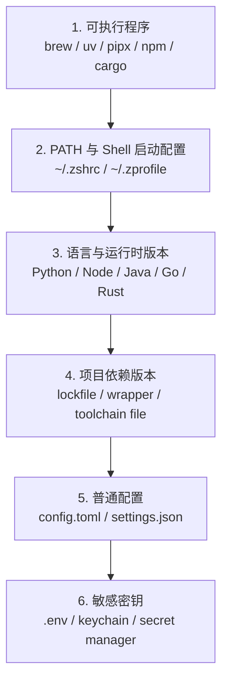

很多人刚开始折腾开发环境时，都会把所有东西都塞进一个地方：

```bash
~/.zshrc
```

一开始看起来很方便。

比如：

```bash
export PATH="/opt/homebrew/bin:$PATH"
export PATH="/opt/homebrew/opt/mysql-client/bin:$PATH"
export JAVA_HOME=$(/usr/libexec/java_home -v 17)
export OPENAI_API_KEY="sk-xxxx"
alias ll="ls -al"
```

打开终端，命令都能用，项目也能跑。

但用久了以后就会发现问题越来越多：

- `python` 到底指向哪个版本？
- `node` 为什么这个项目能跑，另一个项目不能跑？
- `java` 是 17 还是 21？
- `pip install` 装到哪里去了？
- 全局装的 CLI 工具怎么升级、回滚？
- API Key 放在 `.zshrc` 里安全吗？
- 项目配置、个人配置、密钥配置到底该怎么分？

这些问题本质上不是某一个命令的问题，而是开发工具管理没有分层。

我的理解是：

> 开发环境管理，不应该靠一个 `.zshrc` 硬撑，而应该把 **可执行程序、环境变量、普通配置、敏感密钥、版本约束、项目依赖** 分开管理。

这篇文章就整理一下这套边界。

---

## 先给结论

开发工具管理可以拆成六层：



这六层最好不要混在一起。

`.zshrc` 只应该承担很薄的一层：

> 初始化 shell 环境，让系统知道常用命令在哪里，以及设置少量非敏感的交互习惯。

它不应该变成：

- 版本管理中心；
- 项目配置中心；
- 密钥仓库；
- 所有工具的总入口。

---

## `.zshrc` 到底适合放什么

`.zshrc` 是 zsh 的交互式启动配置文件。

每次你打开一个新的终端窗口，它都会被读取。

所以它适合放这些内容：

```bash
# Homebrew
export PATH="/opt/homebrew/bin:/opt/homebrew/sbin:$PATH"

# 用户级 bin 目录
export PATH="$HOME/.local/bin:$PATH"

# Rust 工具链
export PATH="$HOME/.cargo/bin:$PATH"

# 常用 alias
alias ll="ls -al"
alias gs="git status"
```

这些内容有一个共同点：

> 它们是 shell 会话级别的基础设置，不绑定某一个具体项目。

也就是说，`.zshrc` 可以告诉 shell：

```text
你去哪里找命令。
```

但它不应该决定：

```text
某个项目必须用哪个 Python 版本。
某个项目必须用哪个 Node 版本。
某个项目应该使用哪个 API Key。
某个工具的业务配置是什么。
```

这些东西应该放到更具体的地方。

---

## PATH 管的是“命令在哪里”，不是“版本应该是什么”

很多版本混乱，其实都是从 `PATH` 开始的。

当你输入：

```bash
python
```

shell 并不知道你想用哪个 Python。

它只是从 `PATH` 里从左到右查找：

```bash
/opt/homebrew/bin
~/.local/bin
/usr/local/bin
/usr/bin
/bin
```

谁先被找到，就执行谁。

所以你可以用这个命令看当前到底执行的是哪个程序：

```bash
which python
which python3
which node
which java
```

也可以用这个看 `PATH` 的搜索顺序：

```bash
echo $PATH | tr ':' '\n'
```

`PATH` 的关键点是：

> 越靠前的目录优先级越高。

比如：

```bash
export PATH="$HOME/.local/bin:$PATH"
```

表示你自己的用户级命令优先。

而：

```bash
export PATH="$PATH:$HOME/.local/bin"
```

表示系统目录优先，你自己的命令最后才会被找。

这也是为什么很多人明明安装了新版本，但终端里仍然运行旧版本。

因为新版本在 `PATH` 里排在后面。

---

## 版本管理不要只靠 PATH

如果只是临时改一下 `PATH`，当然也能切版本。

但这不是一个稳定的方法。

比如你想让某个项目用 Python 3.12，另一个项目用 Python 3.11，如果你只靠 `.zshrc` 改 `PATH`，就会变成全局生效。

最后很容易出现这种情况：

```text
项目 A 需要 Python 3.12
项目 B 需要 Python 3.10
项目 C 需要 Node 20
项目 D 需要 Node 22
项目 E 需要 Java 17
项目 F 需要 Java 21
```

如果这些都写进 `.zshrc`，它就会越来越乱。

更好的方式是：

> 全局只提供基础工具，具体版本由项目自己声明。

也就是：

```text
全局环境负责“能找到工具”。
项目环境负责“用哪个版本”。
```

---

## 版本管理要分四类

开发工具里的“版本”其实不是一种东西。

至少要分成四类。

### 1. 系统工具版本

这类工具通常通过 Homebrew 管理：

```bash
brew install git
brew install ripgrep
brew install mysql-client
```

它们通常是机器级别的基础工具。

比如：

- `git`
- `rg`
- `fzf`
- `mysql`
- `openssl`
- `cmake`
- `pkg-config`

这类工具可以全局安装。

因为它们大多数不是某个项目的直接运行时依赖，而是开发辅助工具。

但也要注意一点：

> Homebrew 更适合安装通用系统工具，不适合精确管理每个项目的语言依赖版本。

比如 Python、Node、Java 可以用 Homebrew 安装，但如果你有多个项目，最好还是使用专门的版本管理方式。

---

### 2. 语言运行时版本

这类版本最容易出问题。

包括：

- Python 3.10 / 3.11 / 3.12
- Node 18 / 20 / 22
- Java 8 / 11 / 17 / 21
- Go 1.21 / 1.22 / 1.23
- Rust stable / nightly

它们不只是一个命令，而是项目运行环境的一部分。

所以它们最好不要只写在 `.zshrc`。

更好的方式是项目级声明。

比如 Python 可以用：

```text
.python-version
```

Node 可以用：

```text
.node-version
.nvmrc
```

Java 可以用：

```text
.java-version
sdkmanrc
```

Rust 可以用：

```text
rust-toolchain.toml
```

Go 可以在 `go.mod` 里声明：

```go
module example.com/app

go 1.22
```

这些文件的作用是：

> 让项目自己说明它需要什么运行时版本。

这样别人 clone 项目之后，不需要猜。

---

### 3. 项目依赖版本

运行时版本只是第一层。

项目内部依赖也需要锁定。

不同生态有不同文件：

```text
Python: pyproject.toml + uv.lock / poetry.lock / requirements.txt
Node: package.json + pnpm-lock.yaml / package-lock.json / yarn.lock
Java: pom.xml / build.gradle + wrapper
Go: go.mod + go.sum
Rust: Cargo.toml + Cargo.lock
```

这里的核心是 lockfile。

比如 Node 项目里：

```text
package.json      声明依赖范围
pnpm-lock.yaml    锁定实际安装版本
```

Python 项目里：

```text
pyproject.toml    声明依赖范围
uv.lock           锁定实际解析结果
```

Rust 项目里：

```text
Cargo.toml        声明依赖范围
Cargo.lock        锁定实际依赖图
```

lockfile 的意义是：

> 不只是“这个项目需要哪些库”，而是“这次可复现构建具体用了哪些版本”。

所以团队协作时，lockfile 通常应该提交到仓库。

否则就可能出现：

```text
你本地能跑。
我本地不能跑。
CI 能跑。
线上不能跑。
```

本质上就是依赖解析结果不一致。

---

### 4. CLI 工具自身版本

还有一类很容易被忽略：全局安装的 CLI 工具版本。

比如：

```bash
uv tool install black
uv tool install ruff
pipx install poetry
npm install -g pnpm
cargo install cargo-edit
```

这些工具不是某个项目的依赖，但会影响开发流程。

比如格式化工具、lint 工具、构建工具，一旦版本不同，就可能导致结果不同。

所以它们可以分两种管理方式。

一种是全局安装，适合个人常用工具：

```bash
uv tool install ruff
uv tool install black
```

另一种是项目内固定，适合团队必须一致的工具：

```bash
uv run ruff check .
pnpm exec eslint .
./gradlew build
cargo fmt
```

判断标准很简单：

> 如果工具版本会影响项目产物，就应该由项目锁定。  
> 如果只是个人效率工具，可以全局安装。

---

## 推荐的版本管理策略

我觉得比较舒服的策略是：

```text
系统工具：Homebrew
语言版本：mise / asdf / pyenv / nvm / SDKMAN 这类工具
Python 项目依赖：uv
Node 项目依赖：pnpm + corepack
Java 项目构建：Maven Wrapper / Gradle Wrapper
Go 项目依赖：go.mod + go.sum
Rust 项目依赖：rust-toolchain.toml + Cargo.lock
CLI 工具：uv tool / pipx / npm global / cargo install
```

如果想更统一，可以用 `mise` 或 `asdf` 管多语言版本。

比如项目根目录放一个：

```toml
# .mise.toml
[tools]
python = "3.12"
node = "22"
java = "21"
go = "1.22"
rust = "stable"
```

这样一个项目需要什么运行时版本，就在项目里声明清楚。

进入项目目录时，工具自动切换版本。

这比在 `.zshrc` 里写一堆全局变量要清晰很多。

---

## Python 项目怎么管理版本

Python 最容易乱，因为系统里可能同时存在：

```text
/usr/bin/python3
/opt/homebrew/bin/python3
~/.pyenv/shims/python
项目里的 .venv/bin/python
```

所以 Python 项目最好有三层约束。

### 第一层：声明 Python 版本

例如：

```text
.python-version
```

内容是：

```text
3.12
```

或者用 `.mise.toml`：

```toml
[tools]
python = "3.12"
```

### 第二层：使用虚拟环境

项目目录下创建：

```text
.venv/
```

这样依赖就不会装到全局 Python 里。

常见命令是：

```bash
uv venv
uv sync
```

或者：

```bash
python -m venv .venv
source .venv/bin/activate
pip install -r requirements.txt
```

### 第三层：锁定依赖版本

如果用 `uv`：

```text
pyproject.toml
uv.lock
```

如果用传统 pip：

```text
requirements.txt
```

更推荐的结构是：

```text
my-project/
├── .python-version
├── .venv/
├── pyproject.toml
├── uv.lock
└── src/
```

其中：

- `.python-version` 管 Python 大版本；
- `.venv` 隔离项目环境；
- `pyproject.toml` 声明依赖；
- `uv.lock` 锁定依赖解析结果。

不要把项目依赖装进全局 Python。

否则迟早会遇到：

```text
这个包到底是谁装的？
为什么删了一个项目，另一个项目也坏了？
为什么命令行能跑，IDE 不能跑？
```

---

## Node 项目怎么管理版本

Node 也类似。

常见问题是：

```bash
node -v
npm -v
pnpm -v
```

在不同项目里版本不一样。

推荐做法是项目里声明 Node 版本：

```text
.node-version
```

内容：

```text
22
```

或者：

```text
.nvmrc
```

内容：

```text
v22
```

同时在 `package.json` 里声明包管理器版本：

```json
{
  "packageManager": "pnpm@9.15.0"
}
```

这样配合 corepack 使用时，团队成员可以自动使用一致的 pnpm 版本。

依赖版本靠 lockfile 锁定：

```text
package.json
pnpm-lock.yaml
```

推荐结构：

```text
web-app/
├── .node-version
├── package.json
├── pnpm-lock.yaml
└── src/
```

团队里不要只说一句：

```text
用最新版 Node 就行。
```

这句话非常危险。

因为“最新版”每天都可能变。

项目应该明确写：

```text
Node 22
pnpm 9.15.0
```

这样才是可复现的。

---

## Java 项目怎么管理版本

Java 的问题通常是 `JAVA_HOME`。

很多人会在 `.zshrc` 里写：

```bash
export JAVA_HOME=$(/usr/libexec/java_home -v 17)
```

这没问题，但它是全局默认值。

如果你所有项目都用 Java 17，这样很舒服。

但如果你有的项目用 Java 8，有的用 Java 17，有的用 Java 21，就不能全靠 `.zshrc`。

更好的做法是：

```text
全局 JAVA_HOME 只作为默认值。
具体项目用 wrapper 和 toolchain 约束。
```

Maven 项目可以用：

```text
mvnw
.mvn/wrapper/
pom.xml
```

Gradle 项目可以用：

```text
gradlew
gradle/wrapper/
build.gradle
```

Wrapper 的意义是：

> 不要求所有人本机安装完全一样的 Maven 或 Gradle，而是项目自己带着构建工具入口。

对于 JDK 版本，可以在构建文件里明确声明。

比如 Gradle：

```kotlin
java {
    toolchain {
        languageVersion.set(JavaLanguageVersion.of(21))
    }
}
```

或者 Maven Compiler Plugin 里声明：

```xml
<properties>
    <maven.compiler.release>21</maven.compiler.release>
</properties>
```

这样比只靠个人 `.zshrc` 里的 `JAVA_HOME` 更可靠。

---

## Go 和 Rust 项目怎么管理版本

Go 相对简单。

项目里通常有：

```text
go.mod
go.sum
```

`go.mod` 里可以声明：

```go
go 1.22
```

`go.sum` 锁定依赖校验信息。

Rust 项目通常有：

```text
Cargo.toml
Cargo.lock
rust-toolchain.toml
```

如果项目需要固定 Rust toolchain，可以写：

```toml
# rust-toolchain.toml
[toolchain]
channel = "stable"
components = ["rustfmt", "clippy"]
```

或者固定到具体版本：

```toml
[toolchain]
channel = "1.78.0"
components = ["rustfmt", "clippy"]
```

这类文件的好处是，版本要求跟着项目走，而不是跟着某个人的电脑走。

---

## 全局安装和项目安装怎么选

一个常见问题是：

> 工具到底应该全局安装，还是项目里安装？

我的判断标准是：

```text
影响项目结果的，放项目里。
只影响个人效率的，放全局。
```

比如这些更适合项目锁定：

- formatter；
- linter；
- test runner；
- build tool；
- code generator；
- migration tool；
- bundler；
- compiler；
- framework CLI。

因为它们会影响代码格式、构建结果、生成文件和 CI 行为。

这些可以全局安装：

- `rg`
- `fd`
- `fzf`
- `jq`
- `tree`
- `htop`
- 个人常用脚本
- 通用命令行助手

比如：

```bash
brew install ripgrep fd fzf jq tree
```

它们不会直接决定项目产物，只是提高搜索、查看、定位问题的效率。

---

## 普通配置应该放哪里

普通配置不是密钥。

比如：

```text
默认模型
默认 provider
默认工作目录
默认主题
默认审批策略
默认日志级别
默认输出格式
```

这些适合放在用户级配置文件中。

例如：

```text
~/.config/my-tool/config.toml
```

或者：

```text
~/.my-tool/config.toml
```

示例：

```toml
[model]
provider = "example-provider"
name = "example-model"

[workspace]
default_root = "~/projects"

[ui]
theme = "dark"

[log]
level = "info"
```

这种配置文件可以手动编辑，也可以由命令生成：

```bash
my-tool config set model.provider example-provider
my-tool config set ui.theme dark
```

普通配置的特点是：

- 不敏感；
- 可以长期保存；
- 可以被备份；
- 可以迁移到新机器；
- 有些甚至可以进 dotfiles 仓库。

但注意，不要把 API Key、Token、Secret 混进去。

---

## 项目配置应该放哪里

除了用户级配置，还有项目级配置。

比如一个工具的全局默认值是：

```toml
[model]
name = "fast-model"
```

但某个项目希望使用另一个模型，或者使用不同的运行策略。

这时候应该允许项目根目录放自己的配置：

```text
.my-tool.toml
```

示例：

```toml
[model]
name = "accurate-model"

[workspace]
include = ["src", "tests", "docs"]
exclude = ["node_modules", "dist", ".venv"]
```

配置优先级可以设计成：

```text
命令行参数 > 环境变量 > 项目配置 > 用户配置 > 默认配置
```

比如：

```text
--model accurate-model
```

优先级最高。

因为命令行参数表达的是：

> 我这一次运行就是要这么做。

项目配置表达的是：

> 这个项目默认应该这么做。

用户配置表达的是：

> 我个人默认喜欢这么做。

默认配置表达的是：

> 工具没有任何配置时也能运行。

这套优先级很重要。

否则配置来源多了以后，用户根本不知道当前到底生效的是哪一份配置。

---

## 密钥不要和普通配置混在一起

密钥包括：

- API Key；
- Access Token；
- Refresh Token；
- 私钥；
- 数据库密码；
- 云服务凭证；
- webhook secret。

这些不应该直接放在 `.zshrc` 里，也不应该和普通配置混在一个可以随便备份的文件里。

更合理的选择有几种。

### 1. 项目本地 `.env`

适合项目开发。

```text
.env
.env.local
```

仓库里提交：

```text
.env.example
```

`.env.example` 里只写变量名，不写真实值：

```bash
DATABASE_URL=""
API_KEY=""
MODEL_PROVIDER=""
```

真实 `.env` 加进 `.gitignore`：

```text
.env
.env.local
```

这样团队成员知道需要哪些配置，但不会把真实密钥提交上去。

### 2. 系统 Keychain

适合长期保存个人凭证。

macOS 可以用 Keychain。

很多 CLI 工具登录以后，本质上就是把 token 存进系统凭证管理器，或者存进受权限保护的本地目录。

这种方式比明文写在 `.zshrc` 里更好。

### 3. 专门的密钥管理工具

如果是团队、公司、生产环境，就应该用更正式的方案。

比如：

```text
1Password
Doppler
Vault
AWS Secrets Manager
GCP Secret Manager
Azure Key Vault
Kubernetes Secret
```

本地开发可以简单一点。

生产环境不要靠 `.env` 文件手工复制。

---

## 为什么密钥不适合放在 `.zshrc`

很多教程会这么写：

```bash
export SOME_API_KEY="xxxx"
```

这不是完全不能用。

但它有几个明显问题。

### 1. 作用域太大

写进 `.zshrc` 之后，从这个终端启动的子进程都能继承它。

比如：

```bash
python app.py
node server.js
some-cli
```

这些进程都可能读到环境变量。

如果某个程序打印环境信息、上传调试日志，密钥就可能暴露。

### 2. 容易被同步到 dotfiles

很多人会把自己的 shell 配置放到 GitHub 上同步。

一旦 `.zshrc` 里有真实密钥，就有误提交风险。

更麻烦的是，删掉之后 Git 历史里也可能还在。

### 3. 不方便按项目隔离

不同项目可能需要不同账号、不同 provider、不同环境。

如果都放全局 `.zshrc`，就会变成：

```text
所有项目共享同一套密钥。
```

这不利于权限隔离，也不利于排查问题。

### 4. 不方便轮换

密钥应该可以轮换。

如果散落在 `.zshrc`、项目脚本、CI 配置、本地临时文件里，后面换 key 会很痛苦。

---

## 一个比较干净的目录结构

我比较推荐把个人开发环境整理成这样：

```text
~
├── .zshrc                         # shell 交互配置
├── .zprofile                      # 登录 shell 配置，可放 Homebrew 初始化
├── .config/
│   ├── git/
│   │   └── config
│   ├── my-tool/
│   │   └── config.toml            # 普通配置，不放密钥
│   └── mise/
│       └── config.toml            # 全局默认语言版本
├── .local/
│   └── bin/                       # 用户级可执行文件
├── .ssh/                          # SSH key，注意权限
├── projects/
│   └── demo-app/
│       ├── .env                   # 本项目真实密钥，不提交
│       ├── .env.example           # 示例配置，可提交
│       ├── .python-version        # Python 版本
│       ├── pyproject.toml         # Python 项目配置
│       ├── uv.lock                # Python 锁文件
│       └── src/
└── Library/Keychains/             # macOS Keychain，系统管理
```

重点不是目录名字一模一样，而是职责清晰：

```text
.zshrc             管 shell 初始化
.config            管普通配置
.env               管项目本地敏感配置
lockfile           管项目依赖版本
版本声明文件        管语言运行时版本
Keychain           管长期敏感凭证
```

---

## 推荐的 `.zshrc` 写法

`.zshrc` 不需要很长。

可以保持成这样：

```bash
# Homebrew
if [[ -x /opt/homebrew/bin/brew ]]; then
  eval "$(/opt/homebrew/bin/brew shellenv)"
fi

# User local bin
export PATH="$HOME/.local/bin:$PATH"

# Rust cargo bin
export PATH="$HOME/.cargo/bin:$PATH"

# Common aliases
alias ll="ls -al"
alias gs="git status"

# Optional: mise / asdf / direnv init
# eval "$(mise activate zsh)"
# eval "$(direnv hook zsh)"
```

然后尽量不要在里面放：

```bash
export API_KEY="xxxx"
export DATABASE_PASSWORD="xxxx"
export PROJECT_SPECIFIC_CONFIG="xxxx"
```

也不要把一堆项目专用配置写进去。

`.zshrc` 越薄，迁移和排查问题越简单。

---

## 版本管理的核心原则

可以记成四句话。

### 1. 全局只放基础能力

比如：

```text
brew
uv
mise
asdf
nvm
sdkman
rustup
go
```

这些是帮你管理环境的工具。

它们可以全局存在。

### 2. 项目声明自己需要什么

项目里应该有：

```text
.python-version
.node-version
.java-version
rust-toolchain.toml
go.mod
.mise.toml
```

谁 clone 项目，谁就能知道应该用什么版本。

### 3. 依赖必须锁定

项目里应该有：

```text
uv.lock
pnpm-lock.yaml
package-lock.json
yarn.lock
Cargo.lock
go.sum
```

不锁依赖，就是把“今天能跑”寄托在运气上。

### 4. 密钥永远单独管理

密钥不要和普通配置、版本配置混在一起。

可以用：

```text
.env
.env.local
Keychain
1Password
Vault
云厂商 Secret Manager
CI Secret
```

但不要随手塞进 `.zshrc`。

---

## 新机器初始化可以怎么做

如果换了一台新电脑，不应该靠回忆一点点装。

可以准备一个 `Brewfile`：

```ruby
brew "git"
brew "ripgrep"
brew "fd"
brew "fzf"
brew "jq"
brew "tree"
brew "mysql-client"
```

然后执行：

```bash
brew bundle
```

语言版本交给版本管理工具。

项目依赖交给项目自己的 lockfile。

比如：

```bash
# Python
uv sync

# Node
corepack enable
pnpm install --frozen-lockfile

# Java
./mvnw test
./gradlew build

# Go
go mod download

# Rust
cargo build
```

这样新机器初始化就会变成：

```text
安装系统工具 → 进入项目 → 按项目声明安装对应版本和依赖
```

而不是：

```text
复制一份巨大无比的 .zshrc，然后祈祷一切能跑。
```

---

## 排查开发环境问题的顺序

环境乱的时候，不要一上来就重装。

可以按这个顺序查。

### 1. 查命令来源

```bash
which python
which node
which java
which pnpm
which pip
```

确认当前执行的到底是哪一个。

### 2. 查版本

```bash
python --version
node --version
java -version
pnpm --version
go version
rustc --version
```

确认版本是不是项目要求的。

### 3. 查 PATH 顺序

```bash
echo $PATH | tr ':' '\n'
```

确认是不是旧版本路径排在前面。

### 4. 查项目锁文件

看项目里有没有：

```text
uv.lock
pnpm-lock.yaml
Cargo.lock
go.sum
```

如果没有，先判断是不是依赖没有锁定导致的问题。

### 5. 查环境变量

```bash
env | sort
```

注意不要把输出直接发到公共聊天、issue 或日志系统里，因为里面可能有敏感信息。

### 6. 查工具自己的配置

很多工具应该提供类似命令：

```bash
my-tool config list
my-tool config doctor
my-tool doctor
```

这类命令最好能告诉用户：

```text
当前读取了哪个配置文件
当前命令来自哪个路径
当前使用哪个版本
当前密钥是否存在，但不打印密钥内容
当前项目配置是否覆盖了用户配置
```

好的开发工具不应该让用户猜环境。

---

## 一个工具如果要做得好，应该提供哪些能力

如果你自己在设计 CLI 工具，我觉得至少要考虑这些能力。

### 1. `doctor`

检查环境是否正常：

```bash
my-tool doctor
```

应该输出：

```text
CLI version: 1.2.3
Config file: ~/.config/my-tool/config.toml
Project config: ./my-tool.toml
Runtime: Python 3.12
Git: found
API key: found, source = Keychain
Workspace: /Users/me/projects/demo
```

注意，密钥只显示是否存在，不显示真实值。

### 2. `config`

管理普通配置：

```bash
my-tool config get model.name
my-tool config set model.name example-model
my-tool config list
```

配置文件应该可读、可编辑、可迁移。

### 3. `auth`

管理认证和密钥：

```bash
my-tool auth login
my-tool auth status
my-tool auth logout
```

`auth` 不应该把密钥写进普通配置文件。

更好的方式是写入系统凭证管理器，或者受权限保护的本地 secret 文件。

### 4. `version`

显示工具自身版本：

```bash
my-tool --version
```

如果工具依赖外部运行时，也最好能显示：

```text
my-tool 1.2.3
python 3.12.4
node 22.3.0
```

这样排查问题会简单很多。

### 5. `upgrade`

如果工具支持自更新，需要明确告诉用户：

```text
当前版本是什么
最新版本是什么
升级命令是什么
是否支持回滚
```

如果是通过包管理器安装的，就不要自己乱改安装目录，而应该提示用户用原来的安装方式升级。

比如：

```bash
brew upgrade my-tool
uv tool upgrade my-tool
pipx upgrade my-tool
npm update -g my-tool
cargo install my-tool --force
```

安装方式和升级方式应该一致。

---

## 不同安装方式不要混用

这也是开发工具管理里很常见的坑。

比如同一个工具，你可能用这些方式都装过：

```bash
brew install my-tool
pipx install my-tool
uv tool install my-tool
npm install -g my-tool
cargo install my-tool
```

然后终端里执行：

```bash
my-tool
```

你以为运行的是刚升级的版本。

但实际上可能是另一个路径里的旧版本。

所以安装工具时要尽量保持一个原则：

> 同一个工具，只保留一种主要安装方式。

如果不确定当前执行的是哪个，可以查：

```bash
which my-tool
my-tool --version
```

如果发现多个路径都有，就清理掉不用的版本。

---

## 最后总结

开发工具管理不是把所有环境变量都塞进 `.zshrc`。

更合理的边界是：

```text
PATH              只负责找到命令
.zshrc            只负责 shell 初始化
Homebrew          管系统工具
版本管理器         管语言运行时版本
项目声明文件       管项目需要的运行时版本
lockfile          管项目依赖版本
config.toml       管普通配置
.env / Keychain   管敏感密钥
wrapper           管项目构建工具版本
```

这样做的好处是：

- 新机器更容易初始化；
- 项目更容易复现；
- 团队成员环境更一致；
- 密钥不容易泄漏；
- 版本冲突更容易排查；
- `.zshrc` 不会越来越像垃圾堆。

一句话概括：

> 全局环境只提供基础能力，项目自己声明版本和依赖，密钥永远单独管理。

这才是开发工具管理真正应该关注的东西。
