很多人第一次学 `asyncio`，最容易卡在一个问题上：

> `await` 不就是停在那里等吗？那让出去之后有什么用？

这个问题非常关键。因为如果只说：

> `await` 会暂停当前协程，把执行权交还给 event loop。

这句话虽然对，但还不够。它没有解释清楚：

- 为什么当前协程停了，程序整体却没有停？
- 底层库怎么知道这是网络请求，可以让出去？
- `async def` 里面没有 `await`，是不是就相当于普通函数？
- `Future` 到底在这条链路里负责什么？
- 文件读写、数据库查询、HTTP 请求，它们的异步实现是不是一回事？

这篇文章从一个最核心的结论开始：

> **`async def` 不等于异步；`await` 也不自动让普通代码并发。真正的异步能力来自最底层那个“不阻塞 event loop 的 I/O 操作”。**

---

## 1. 先把误区说清楚：async def 只是壳

看这段代码：

```python
async def get_user(user_id):
    return mysql.query(
        "select * from user where id = ?",
        user_id,
    )
```

如果 `mysql.query(...)` 是一个普通同步阻塞函数，那这段代码基本只是：

> **披了一层 `async` 外壳的同步代码。**

它不会因为写了 `async def` 就自动变成异步。

执行到这里：

```python
return mysql.query(...)
```

如果 MySQL 需要 100ms 才返回，那么当前 event loop 就会被卡住 100ms。期间它不能去处理别的协程。

所以这不是我们想要的异步。

真正的异步数据库查询应该类似这样：

```python
async def get_user(user_id):
    return await async_mysql.fetch_one(
        "select * from user where id = ?",
        user_id,
    )
```

关键不是外层的 `async def`，而是里面这句：

```python
await async_mysql.fetch_one(...)
```

前提是 `async_mysql.fetch_one(...)` 本身来自一个真正支持 asyncio 的异步数据库驱动。

---

## 2. 判断一段代码是不是真异步

可以用一个很简单的判断标准：

```text
最内层等待外部结果的地方，是否真的能把控制权交还给 event loop？
```

如果不能，那外面包多少层 `async def` 都没用。

### 假异步

```python
async def dao_get_user(user_id):
    return mysql.query("select ...", user_id)
```

这段代码执行时仍然会阻塞 event loop。

### 真异步

```python
async def dao_get_user(user_id):
    return await async_mysql.fetch_one("select ...", user_id)
```

这段代码在等待数据库返回时，可以暂停当前协程，让 event loop 去运行别的任务。

这就是二者的本质区别。

---

## 3. 一条真实的异步调用链

真实项目里一般不是直接在 controller 里查数据库，而是分层调用：

```python
async def handler(request):
    user = await user_service.get_user(request.user_id)
    return user

async def get_user(user_id):
    return await user_dao.find_by_id(user_id)

async def find_by_id(user_id):
    return await async_mysql.fetch_one(
        "select * from user where id = ?",
        user_id,
    )
```

这里真正让出执行权的是最里面：

```python
await async_mysql.fetch_one(...)
```

外面的 `await` 是在一层层传递这个等待关系。

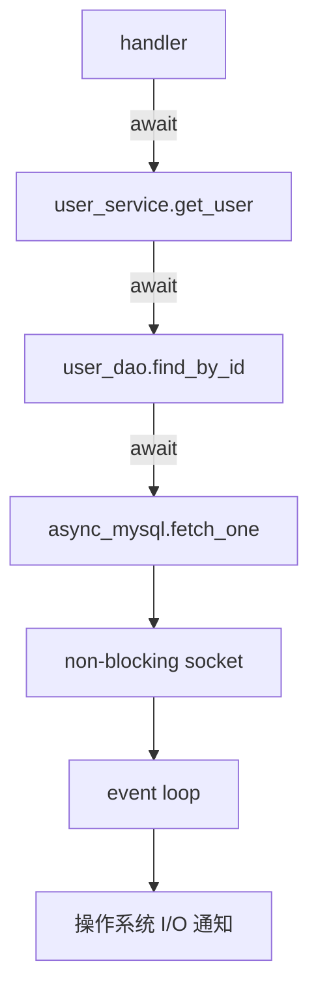

当数据库还没返回时，整条调用链会暂停：

```text
handler 暂停，因为它在等 service
service 暂停，因为它在等 dao
dao 暂停，因为它在等 MySQL 返回
```

然后 event loop 可以去处理别的请求。

等 MySQL 结果回来后，再一层层恢复：

```text
async_mysql 恢复
dao 恢复
service 恢复
handler 恢复
```

---

## 4. `await` 的作用到底是什么？

`await` 的作用不是“让代码变快”。

它的作用是：

> **当前协程需要等待一个异步结果时，先暂停自己，把当前线程还给 event loop。等结果完成后，再从这一行继续执行。**

比如：

```python
result = await something()
```

可以理解成：

```text
如果 something() 已经完成：
    直接拿结果

如果 something() 还没完成：
    当前协程暂停
    event loop 去运行别的任务
    something() 完成后，当前协程恢复
    await 返回结果
```

所以 `await` 是一个**暂停点**。

但它不是并发的全部。

这段代码仍然是串行：

```python
user = await query_user(user_id)
orders = await query_orders(user_id)
recommends = await query_recommends(user_id)
```

它的执行顺序是：

```text
先查 user
再查 orders
再查 recommends
```

如果三者互不依赖，要并发执行，需要用 `asyncio.gather` 或 `create_task`：

```python
user, orders, recommends = await asyncio.gather(
    query_user(user_id),
    query_orders(user_id),
    query_recommends(user_id),
)
```

---

## 5. 一个具体业务场景：聚合首页接口

假设你写一个首页接口，需要同时查三个服务：

- 用户信息服务；
- 订单服务；
- 推荐服务。

同步写法可能是：

```python
def homepage(user_id):
    user = user_client.get_user(user_id)
    orders = order_client.get_orders(user_id)
    recommends = recommend_client.get_recommends(user_id)

    return {
        "user": user,
        "orders": orders,
        "recommends": recommends,
    }
```

如果每个服务耗时 100ms，总耗时大约是：

```text
100ms + 100ms + 100ms = 300ms
```

因为它们是顺序执行的。

异步写法：

```python
async def homepage(user_id):
    user, orders, recommends = await asyncio.gather(
        user_client.get_user(user_id),
        order_client.get_orders(user_id),
        recommend_client.get_recommends(user_id),
    )

    return {
        "user": user,
        "orders": orders,
        "recommends": recommends,
    }
```

前提是这三个 client 都是异步 client。

这时三个请求可以几乎同时发出去。总耗时接近最慢的那个请求，比如 100ms 左右。


```mermaid
gantt
    title 异步调用：三个服务并发等待
    dateFormat  X
    axisFormat %Lms
    section 请求链路
    query_user        :a1, 0, 100
    query_orders      :a2, 0, 100
    query_recommends  :a3, 0, 100
```

注意，异步并不是让单个服务从 100ms 变成 10ms。

它的价值是：

> **把多个 I/O 等待时间重叠起来。**

---

## 6. 那最内层到底怎么“让出去”？

这是最关键的部分。

`await` 本身并不知道这是网络请求、数据库查询，还是 Redis 请求。

真正知道这些的是底层异步库。

比如你写：

```python
response = await client.get("https://example.com")
```

表面上看是 HTTP 请求。

但拆到底层，HTTP 请求本质上是通过 socket 和远程服务器通信。

异步 HTTP 库内部大概会做几件事：

```text
1. 创建 socket
2. 把 socket 设置成 non-blocking
3. 发起连接、发送请求、读取响应
4. 如果暂时不能完成，就创建 Future
5. 把 socket 注册到 event loop
6. 告诉 event loop：这个 socket 可读/可写时通知我
7. 当前协程 await 这个 Future，于是挂起
8. 操作系统通知 event loop：socket 就绪
9. event loop 调用回调
10. 回调读取数据，并 future.set_result(...)
11. await 的协程恢复
```

核心是这句：

> **异步库不是阻塞等待 socket，而是把 socket 注册给 event loop，等操作系统通知。**

---

## 7. 同步 socket 和异步 socket 的区别

普通同步网络读取大概是：

```python
data = sock.recv(4096)
```

如果现在没有数据，线程就会阻塞在这里。

```text
没有数据
线程卡住
直到数据回来
```

异步库会把 socket 设置成非阻塞：

```python
sock.setblocking(False)
```

然后尝试读取。

如果现在没有数据，它不会卡住线程，而是立刻返回一个“现在还没准备好”的信号。

在操作系统层面，常见表现是：

```text
BlockingIOError
EAGAIN
EWOULDBLOCK
```

意思是：

> 现在没有数据，不要阻塞，之后再来。

于是异步库就把这个 socket 注册给 event loop：

```text
等这个 socket 可读的时候，通知我。
```

---

## 8. event loop 怎么知道 socket 可读？

event loop 依赖操作系统的 I/O 多路复用能力。

不同系统底层机制不一样：

```text
Linux: epoll
macOS / BSD: kqueue
老的通用方案: select / poll
Windows: IOCP / Proactor
```

你可以把它们统一理解成：

> **操作系统帮 event loop 盯着很多 socket，哪个 socket 有数据了，就通知 event loop。**

event loop 不需要自己疯狂循环检查。

它会对操作系统说：

```text
帮我盯着这些 socket：

fd=11：什么时候可读？
fd=12：什么时候可写？
fd=13：什么时候连接成功？
```

然后操作系统在对应事件发生时通知它。

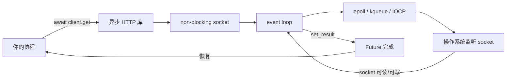

---

## 9. Future 在这里负责什么？

`Future` 是这条链路里的“结果盒子”。

当底层 I/O 还没完成时，异步库会创建一个 Future。

当前协程 `await` 这个 Future。

```python
result = await future
```

如果 Future 没完成，当前协程就暂停。

等 socket 可读了，event loop 调用底层回调，回调读取数据，然后：

```python
future.set_result(data)
```

Future 完成后，等待它的协程就会恢复。

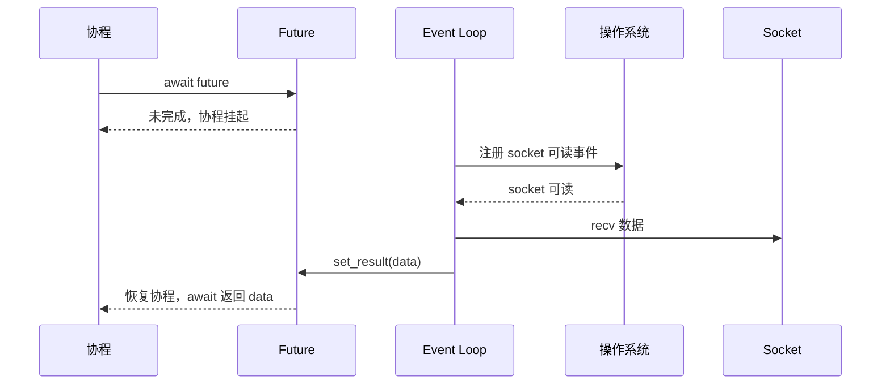

所以 `Future` 不是用来执行任务的。

它负责表达：

> **这里未来会有一个结果。结果没出来之前，谁 await 它，谁就先暂停。**

---

## 10. Task 又是什么？

`Task` 是 `Future` 的子类。

它比普通 Future 多一个能力：

> **Task 会驱动一个 coroutine 执行。**

比如：

```python
async def fetch_user():
    return await async_mysql.fetch_one("select ...")

task = asyncio.create_task(fetch_user())
```

这里：

```text
fetch_user() 是 coroutine
create_task(fetch_user()) 把这个 coroutine 交给 event loop 调度
返回的 task 本身也是一个 Future
```

所以你可以：

```python
user = await task
```

`Task` 和 `Future` 的关系可以这样理解：

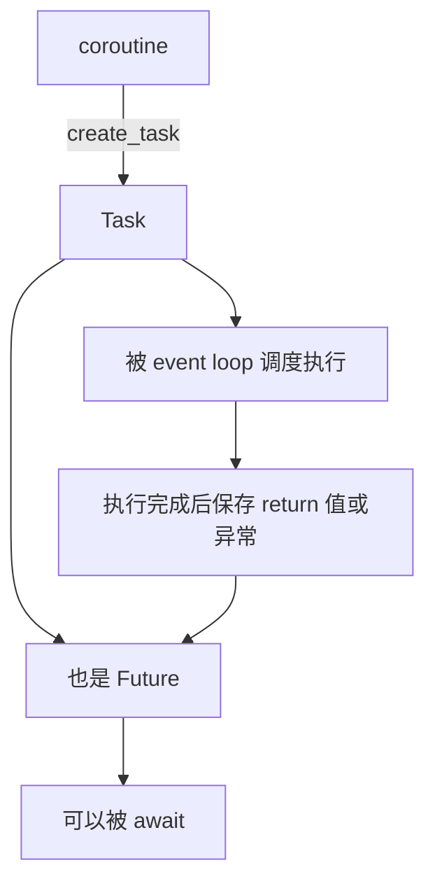

一句话：

> **Future 是结果盒子；Task 是会运行 coroutine 的结果盒子。**

---

## 11. event loop 内部大概维护什么？

可以把 event loop 想成一个调度器。

它大概维护几类东西：

```text
ready 队列：
    现在就能运行的回调或协程片段

timer 队列：
    某个时间点要恢复的任务

I/O 监听表：
    fd -> 等它可读/可写时要执行的回调
```

比如：

```python
await client.get(url)
```

可能会往 I/O 监听表里注册：

```text
fd=12, 等待可读, 回调=继续读取 HTTP 响应
```

比如：

```python
await asyncio.sleep(1)
```

可能会往 timer 队列里注册：

```text
1 秒后恢复这个协程
```

比如：

```python
await queue.get()
```

可能会把当前协程对应的 Future 放到队列的等待者列表里。

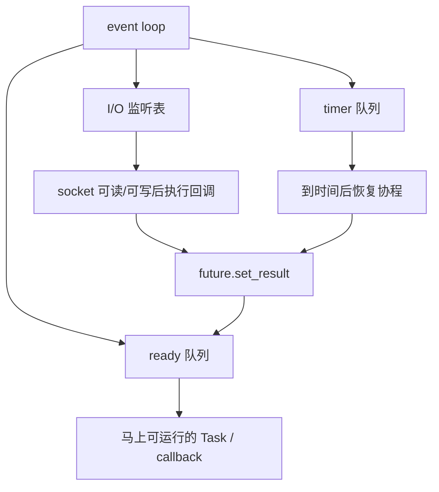

event loop 大概循环做这些事：

```text
1. 执行 ready 队列里的任务
2. 看最近的 timer 什么时候到期
3. 等待操作系统通知 I/O 事件
4. 把就绪的 I/O 回调放进 ready 队列
5. 把到期的 timer 放进 ready 队列
6. 继续循环
```

---

## 12. HTTP 请求内部大概会 await 什么？

你写：

```python
response = await client.get("https://example.com")
```

一个真实 HTTP 请求内部可能经历：

```text
DNS 解析
TCP 连接
TLS 握手
发送 HTTP 请求头和请求体
等待响应头
读取响应体
关闭或复用连接
```

其中很多阶段都可能发生等待。

拆开看大概是：

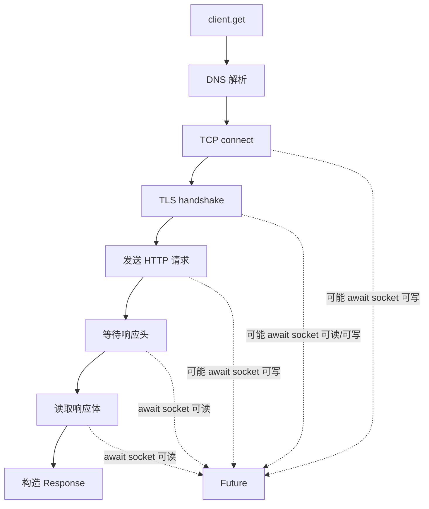

最底层不是 `await` 识别了 HTTP，而是 HTTP 库在不同阶段把 socket 事件包装成 Future。

---

## 13. 数据库为什么也能异步？

数据库客户端也是类似的。

MySQL、PostgreSQL、Redis 这类服务，本质上都是通过网络协议通信。

比如：

```python
row = await async_mysql.fetch_one("select ...")
```

底层大概是：

```text
把 SQL 编码成 MySQL 协议包
通过 socket 发送给 MySQL Server
等待 MySQL Server 返回数据包
socket 没数据时挂起当前协程
socket 有数据时恢复读取
解析协议包
返回 row
```

所以数据库异步的关键不是 SQL 本身，而是：

> **数据库连接底层也是 socket。socket 可以设置为非阻塞，并注册到 event loop。**

Redis、消息队列、WebSocket 也类似。


---

## 14. 文件读写为什么不完全一样？

普通文件读写和网络 socket 不完全一样。

网络 socket 很适合 event loop，因为 socket 有“可读/可写”事件。

但普通磁盘文件在很多系统上并不适合用同样的方式注册到 `epoll` 或 `kqueue`。

所以很多 Python 里的异步文件库，底层其实是：

> **把阻塞文件读写丢到线程池里执行，避免阻塞 event loop。**

比如思想上类似：

```python
async def read_file(path):
    return await asyncio.to_thread(read_file_sync, path)
```

流程是：

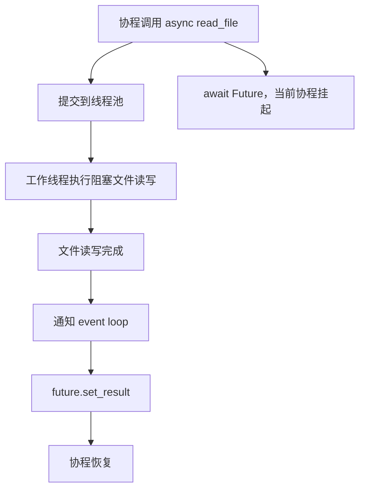

所以文件 I/O 的“异步”经常不是纯事件驱动，而是线程池包装。

这不影响使用，但要理解它和网络 I/O 的底层机制不完全一样。

---

## 15. 网络 I/O、文件 I/O、CPU 计算的区别

| 场景 | 常见异步实现 | 是否适合 asyncio |
|---|---|---|
| HTTP 请求 | 非阻塞 socket + event loop | 很适合 |
| MySQL / PostgreSQL | 非阻塞 socket + 协议解析 | 很适合 |
| Redis | 非阻塞 socket | 很适合 |
| WebSocket | 非阻塞 socket | 很适合 |
| 普通文件读写 | 多数通过线程池包装 | 可以用，但不是 asyncio 最强项 |
| CPU 密集计算 | 不会自动让出执行权 | 不适合，应该用线程池、进程池或 GPU |

如果你写：

```python
async def calc():
    total = 0
    for i in range(10_000_000):
        total += i
    return total
```

这段代码虽然是 `async def`，但里面没有任何真正的异步等待点。

它会一直占着 event loop 跑，直到计算结束。

所以：

> **asyncio 适合 I/O 密集型，不适合直接加速 CPU 密集型。**

---

## 16. 为什么 `asyncio.gather` 有用？

`await` 是等待点。

`gather` 是把多个 awaitable 组织起来一起等。

比如：

```python
result1 = await call_a()
result2 = await call_b()
result3 = await call_c()
```

这是串行。

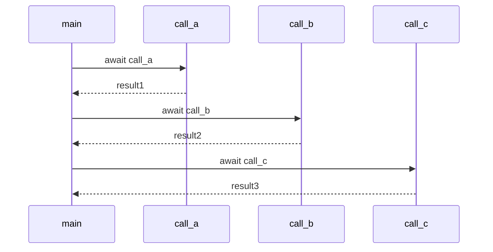

而：

```python
result1, result2, result3 = await asyncio.gather(
    call_a(),
    call_b(),
    call_c(),
)
```

是并发等待。

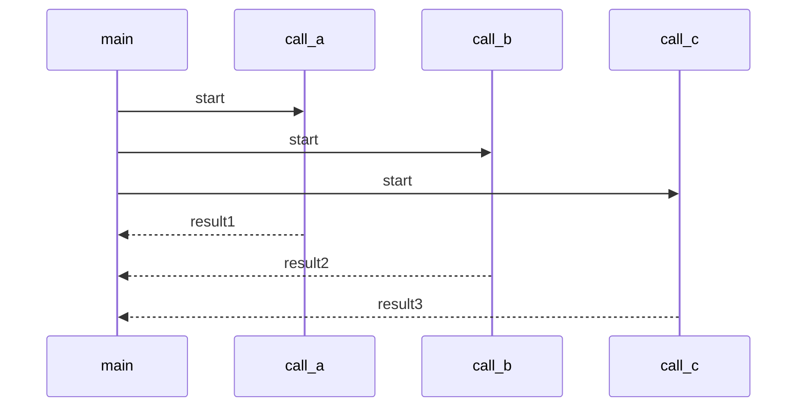

`gather` 的价值是：

> **把多个互不依赖的 I/O 等待同时发出去，然后一起等结果。**

---

## 17. 为什么只有一个任务时，await 看起来没用？

如果你的程序只有一个协程：

```python
async def main():
    result = await fetch()
    print(result)
```

当 `fetch()` 在等网络时，`main` 确实停在那里。

event loop 看一圈：

```text
还有其他任务可以跑吗？
没有。
那我只能等网络返回。
```

所以一个任务时，异步的优势不明显。

异步的价值出现在：

```text
有很多任务都在等待 I/O
```

比如一个 Web 服务同时有很多请求：

```text
请求 1：等数据库
请求 2：等 Redis
请求 3：等 HTTP 服务
请求 4：等数据库
...
```

当请求 1 等数据库时，event loop 可以处理请求 2、3、4。

所以：

> **await 不是让一个等待变短，而是让很多等待互不堵塞。**

---

## 18. 把整个机制串起来

现在把所有东西连起来看。

你写：

```python
async def homepage(user_id):
    user, orders, recommends = await asyncio.gather(
        user_client.get_user(user_id),
        order_client.get_orders(user_id),
        recommend_client.get_recommends(user_id),
    )
    return user, orders, recommends
```

如果三个 client 都是真正的异步 client，完整链路是：

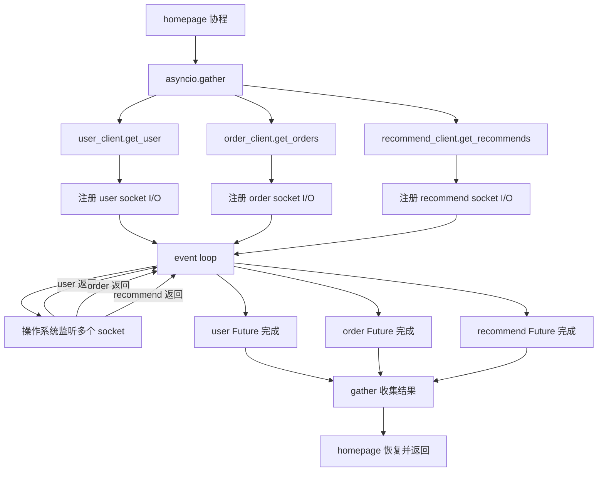

这才是 asyncio 的价值：

> **单个线程可以挂住很多 I/O 等待任务，谁准备好了就恢复谁。**

---

## 19. 几个常见错误

### 错误一：以为 `async def` 自动异步

```python
async def get_user(user_id):
    return mysql.query("select ...", user_id)
```

如果 `mysql.query` 是同步阻塞函数，这就是假异步。

---

### 错误二：在 async 函数里调用阻塞库

```python
async def fetch():
    return requests.get("https://example.com")
```

`requests.get` 是同步阻塞的，会卡住 event loop。

应该用异步 HTTP 客户端，比如：

```python
async def fetch(client):
    response = await client.get("https://example.com")
    return response.text
```

---

### 错误三：以为连续 await 就是并发

```python
user = await query_user()
orders = await query_orders()
```

这是串行。

要并发，应该：

```python
user, orders = await asyncio.gather(
    query_user(),
    query_orders(),
)
```

---

### 错误四：CPU 计算里写 async

```python
async def heavy_calc():
    for i in range(100_000_000):
        ...
```

这不会自动让出 event loop。

CPU 密集任务应该考虑：

```text
线程池
进程池
C 扩展
GPU
任务队列
```

---

## 20. 最后用一句话总结

`asyncio` 不是靠 `async def` 这个关键字变快的。

它真正依赖的是这条链路：

```text
异步库
  -> 非阻塞 I/O 或线程池包装
  -> Future 表示未来结果
  -> event loop 调度等待关系
  -> 操作系统通知 I/O 就绪
  -> Future 完成
  -> await 的协程恢复
```

可以压缩成一句：

> **`await` 只负责等；event loop 只负责调度；Future 负责承载结果；真正把等待变成“不阻塞”的，是底层异步库和操作系统 I/O 机制。**

所以判断一段 asyncio 代码是否真正有意义，只看一个问题：

> **最里面等待外部结果的那一步，是真的异步 I/O，还是同步阻塞函数？**

如果是同步阻塞函数，外面包再多 `async def` 都只是壳。

如果是真正的异步 I/O，`await` 才能把等待时间让出来，让 event loop 去推进其他任务。
